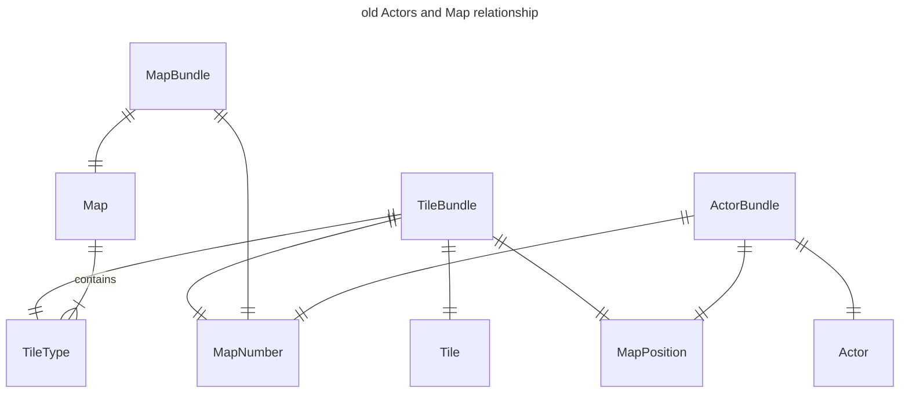
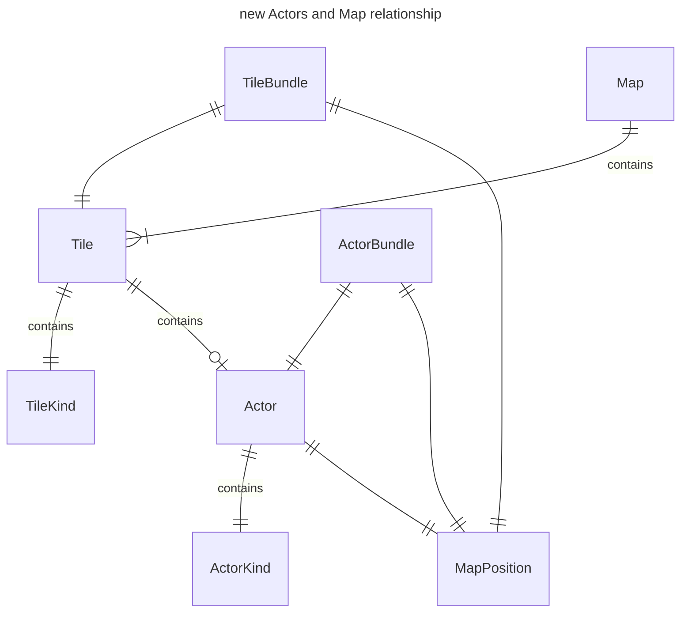
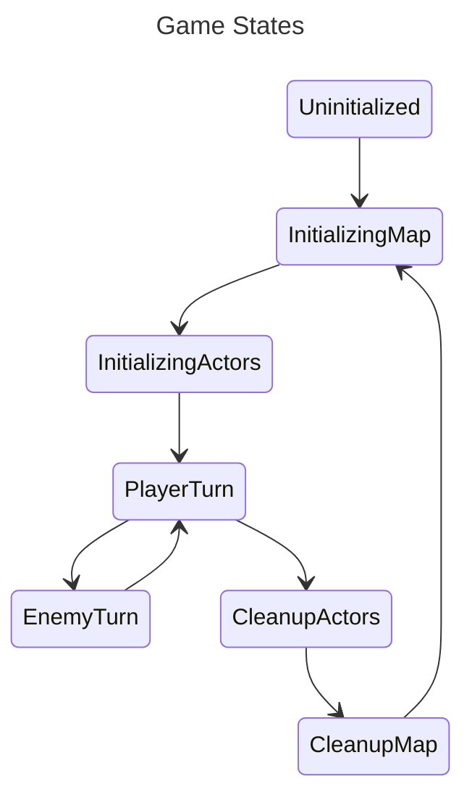

This is already the fifth blog post about this project! It's probably the
longest I've dedicated to a single project. In this entry, I've focused on 
extensive refactoring, tackling code smells, and laying down the groundwork for
what will eventually become the pathfinding system.

Additionally, I managed to enable [Mermaid diagrams](https://mermaid.js.org/)
rendering in my [hugo](https://gohugo.io/) theme. As we say in French, *une
image vaut mille mots* (a picture is worth a thousand words), so I hope the
diagrams will help illustrate the changes I've made to the project.

1. [Bug Fixing: Actors overlapping](#bug-fixing-actors-overlapping-and-on-non-walkable-tiles)
2. [Refactor: Actors positions owned by Map](#refactor-actors-positions-owned-by-map)
3. [Mechanics/System: Actors spawning](#mechanicssystem-actors-spawning)
3. [Mechanics/System: Actors movement](#mechanicssystem-actors-movement)
    1. [Random movements](#random-movements)
    2. [Straight forward movements](#straight-forward-movements)
4. [Miscellaneous](#miscellaneous)
5. [Final result](#final-result)
6. [Closing thoughts](#closing-thoughts)

You can still read the [previous devlog](/posts/devlog-0003) if you missed it.

---

## Bug Fixing: Actors overlapping and on non-walkable tiles

Last month, the map and actors cleanup were introduced when the player leaves
to another map. I didn't notice at the time, but the order of operations is
important as it resulted in a bug where actors are left over the new map and
possibly overlap with other actors or non-walkable tiles.






The solving involved doing this order of operations:

1. Initialize Map
2. Initialize Actors
3. Cleanup Actors
4. Cleanup Map

Instead of:

1. Initialize Map
2. Initialize Actors
3. Cleanup Map
4. Cleanup Actors

I won't go into code details because I've went through big refactors on how the
actors are associated with map tiles (see following section).

---

## Refactor: Actors' positions owned by Map

In an over-engineered ECS fashion, I previously created a component `MapNumber`
to represent how actors and maps are linked together. Why I did it that way was
because I thought it would be easier to implement batch generation for maps (
i.e. generate `n` maps, for map `0` to `n`, generate `x` mobs).



This is a typical case of premature optimization, as batch generation for maps
is not a thing for now. Making this ownership via a component was a bad idea as
it impacted all systems by making the queries chunkier and adding additional
filtering everytime something is done for the current map and actors. For
example:

```rust
/// Checks if the player receives a directional input (i.e. an arrow key or a
/// WSQD key pressed), and moves the `Player` position accordingly.
pub fn check_player_directional_input(
    mut next_state: ResMut<NextState<GameState>>,
    mut query_player: Query<&mut MapPosition, With<Player>>,
    query_actors: Query<
        (&MapPosition, &MapNumber),
        (With<Actor>, Without<Player>),
    >,
    query_map: Query<(&Map, &MapNumber)>,
    input: Res<ButtonInput<KeyCode>>,
    current_map_number: Res<CurrentMapNumber>,
) {
    let mut player_pos = query_player.single_mut();

    let map = {
        let mut map_found = None;
        for (m, m_number) in &query_map {
            if m_number.0 == current_map_number.0 {
                map_found = Some(m);
            }
        }
        match map_found {
            Some(m) => m,
            None => {
                panic!(
                    "no map found to check for the directional player input"
                );
            }
        }
    };

    let occupied_pos: Vec<MapPosition> = query_actors
        .iter()
        .filter(|(_, m_n)| m_n.0 == current_map_number.0)
        .map(|(p, _)| p)
        .cloned()
        .collect();

    if input.any_just_pressed([KeyCode::ArrowRight, KeyCode::KeyD])
        && can_move_right(&player_pos, map, &occupied_pos)
    {
        move_right(&mut player_pos);
        next_state.set(GameState::EnemyTurn);
    }

    if input.any_just_pressed([KeyCode::ArrowLeft, KeyCode::KeyA])
        && can_move_left(&player_pos, map, &occupied_pos)
    {
        move_left(&mut player_pos);
        next_state.set(GameState::EnemyTurn);
    }

    if input.any_just_pressed([KeyCode::ArrowUp, KeyCode::KeyW])
        && can_move_up(&player_pos, map, &occupied_pos)
    {
        move_up(&mut player_pos);
        next_state.set(GameState::EnemyTurn);
    }

    if input.any_just_pressed([KeyCode::ArrowDown, KeyCode::KeyS])
        && can_move_down(&player_pos, map, &occupied_pos)
    {
        move_down(&mut player_pos);
        next_state.set(GameState::EnemyTurn);
    }
}
```

The following code is really different from last month, but now, the tiles are
managed by the Map, and actors are managed by the tiles:

```rust
/// Represents a tile.
#[derive(Clone, Component, Copy)]
pub struct Tile {
    pub kind: TileKind,
    pub actor: Option<Actor>,
}
```

```rust
/// Represents the environment where the actors interact together. A map is
/// made of tiles which has different properties for the actors.
#[derive(Component)]
pub struct Map {
    /// The map's width.
    pub width: usize,
    /// The map's height.
    pub height: usize,
    /// All tiles for the map, the vector index corresponds to the tile
    /// coordinates.
    pub tiles: Vec<Tile>,
    /// The exits positions for the map.
    pub exits: Vec<MapPosition>,
}
```

Additionally, a component `OnDisplay` is used to differentiate between the map
and actors that are on the screen with the ones that are kept in memory
(although there's no such thing for now):

```rust
/// Represents an entity that is on the screen and displayable by the camera.
#[derive(Component)]
pub struct OnDisplay;
```



It makes the queries simpler:

```rust
pub fn check_player_move_via_keys(
    mut next_state: ResMut<NextState<GameState>>,
    mut q_actors: Query<(&mut MapPosition, &Actor), With<OnDisplay>>,
    mut q_map: Query<&mut Map, With<OnDisplay>>,
    input: Res<ButtonInput<KeyCode>>,
) {
    let mut map = q_map.single_mut();

    let (mut pos_player, _) = q_actors
        .iter_mut()
        .filter(|(_, a)| a.is_player())
        .last()
        .expect("no player pos found");

    let pos_player_old = pos_player.clone();

    if input.any_just_pressed(KEYS_PLAYER_MOVE_RIGHT)
        && can_move_right(&pos_player.clone(), &map)
    {
        move_right(&mut map, &mut pos_player).unwrap();
    }

    if input.any_just_pressed(KEYS_PLAYER_MOVE_LEFT)
        && can_move_left(&pos_player.clone(), &map)
    {
        move_left(&mut map, &mut pos_player).unwrap();
    }

    if input.any_just_pressed(KEYS_PLAYER_MOVE_UP)
        && can_move_up(&pos_player.clone(), &map)
    {
        move_up(&mut map, &mut pos_player).unwrap();
    }

    if input.any_just_pressed(KEYS_PLAYER_MOVE_DOWN)
        && can_move_down(&pos_player.clone(), &map)
    {
        move_down(&mut map, &mut pos_player).unwrap();
    }

    if pos_player_old != pos_player.clone() {
        next_state.set(GameState::EnemyTurn);
    }
}
```

---

## Mechanics/System: Actors spawning

Previously, the number of actors spawned for a map was hardcoded to be the same
for all maps, regardless of their size or *topography*. To address this issue,
I added `generate_spawn_counts`, that provides the number of mobs to spawn for
a specific map given as a parameter:

```rust
pub fn generate_spawn_counts(_map: &Map) -> HashMap<ActorKind, usize> {
    let mut result = HashMap::new();
    result.insert(ActorKind::Blob, 3);
    result.insert(ActorKind::Rabbit, 3);
    return result;
}
```

Well, the mob quantities are still hardcoded, but at least we can easily adapt
it in the future. Compare by yourself the old and new implementation of mob
spawning:

```rust
/// old implementation
pub fn spawn_mobs_on_current_map(
    mut commands: Commands,
    query_map: Query<(&Map, &MapNumber)>,
    mut query_player_map_position: Query<&mut MapPosition, With<Player>>,
    tileset: Res<TilesetActor>,
    current_map_number: Res<CurrentMapNumber>,
    mut next_game_state: ResMut<NextState<GameState>>,
) {
    let mut current_map = None;
    for (map, map_number) in &query_map {
        if map_number.0 == current_map_number.0 {
            current_map = Some(map);
            break;
        }
    }

    if current_map.is_none() {
        panic!("no current map found with number {}", current_map_number.0);
    }

    let current_map = current_map.unwrap();

    const RABBITS_QUANTITY: usize = 3;
    const BLOB_QUANTITY: usize = 3;
    const ACTOR_QUANTIY: usize = RABBITS_QUANTITY + BLOB_QUANTITY;

    let mut actor_positions = Vec::with_capacity(ACTOR_QUANTIY);
    for _ in 0..ACTOR_QUANTIY {
        let spawn_position =
            current_map.generate_random_spawning_position(&actor_positions);
        match spawn_position {
            Ok(position) => {
                actor_positions.push(position);
            }
            Err(_) => {
                break;
            }
        }
    }

    spawn_creature::<RabbitBundle>(
        &actor_positions[0..RABBITS_QUANTITY],
        &mut commands,
        current_map_number.0,
        &tileset,
    );

    spawn_creature::<BlobBundle>(
        &actor_positions[RABBITS_QUANTITY..],
        &mut commands,
        current_map_number.0,
        &tileset,
    );

    // initialize the player only if there's no player created
    let player_map_position = query_player_map_position.get_single_mut();
    if player_map_position.is_err() {
        let player_spawn_position = match current_map
            .generate_random_spawning_position(&actor_positions)
        {
            Ok(position) => position,
            Err(_) => {
                panic!("player could not spawn");
            }
        };

        spawn_creature::<PlayerBundle>(
            &[player_spawn_position],
            &mut commands,
            current_map_number.0,
            &tileset,
        );
    } else {
        // if the player already exists, set a new spawn on the map
        let new_spawn =
            current_map.generate_random_spawning_position(&actor_positions);

        *player_map_position.unwrap() = match new_spawn {
            Ok(position) => position,
            Err(_) => {
                panic!("failed to initialize player for the first time");
            }
        };
    }
    next_game_state.set(GameState::PlayerTurn);
}
```

```rust
/// new implementation
pub fn spawn_mobs_on_current_map(
    mut commands: Commands,
    mut q_map: Query<&mut Map, With<OnDisplay>>,
    mut q_actors: Query<(&mut MapPosition, &Actor), With<OnDisplay>>,
    tileset: Res<TilesetActor>,
    mut next_game_state: ResMut<NextState<GameState>>,
) {
    let mut map = q_map.single_mut();

    let pos_occupied: Vec<MapPosition> =
        q_actors.iter().map(|(m_p, _)| *m_p).collect();

    let spawn_counts = generate_spawn_counts(&map);
    let actor_quantity = spawn_counts.values().fold(0, |acc, &x| acc + x);
    let pos_actors = map
        .generate_random_positions(actor_quantity, &pos_occupied)
        .unwrap();

    let mut spawned_quantity = 0;
    for (actor_kind, quantity) in spawn_counts.iter() {
        spawn_creature(
            *actor_kind,
            &mut map,
            &pos_actors[spawned_quantity..spawned_quantity + quantity],
            &mut commands,
            &tileset,
        )
        .unwrap();
        spawned_quantity += quantity;
    }

    // initialize the player only if there's no player created
    let pos_player = q_actors.iter_mut().filter(|(_, a)| a.is_player()).last();

    // if the player already exists, set a new spawn on the map
    if let Some(mut pos_player) = pos_player {
        let pos_new_spawn = map
            .generate_random_positions(1, &pos_actors)
            .expect("failed to initialize player spawn")
            .pop()
            .unwrap();

        pos_player.0.x = pos_new_spawn.x;
        pos_player.0.y = pos_new_spawn.y;
    } else {
        let pos_player_spawn = map
            .generate_random_positions(1, &pos_actors)
            .unwrap()
            .last()
            .unwrap()
            .clone();

        spawn_creature(
            ActorKind::Player,
            &mut map,
            &[pos_player_spawn],
            &mut commands,
            &tileset,
        )
        .unwrap();
    }
    next_game_state.set(GameState::PlayerTurn);
}
```
I think that another refactor to come is to handle the player respawn in a
dedicated system, but for now that will be enough refactoring. The function
`spawn_creature` spawns actor entities of a given kind to given positions:

```rust
/// Spawn creatures at specific map positions.
pub fn spawn_creature(
    actor_kind: ActorKind,
    map: &mut Map,
    positions: &[MapPosition],
    commands: &mut Commands,
    tileset: &TilesetActor,
) -> Result<(), String> {
    for position in positions {
        let tile_pos = map.as_tile_index(position).unwrap();
        if map.tiles[tile_pos].actor.is_some() {
            return Err("tile already occupied".into());
        }
        let actor = Actor::new(actor_kind);
        map.tiles[tile_pos].actor = Some(actor);
        commands
            .spawn((OnDisplay, ActorBundle::new(actor, *position, tileset)));
    }
    Ok(())
}
```

---

## Mechanics/System: Actors movement

As a remainder, the game follows these states:



`EnemyTurn` and `PlayerTurn` are respectively the states when the enemies and
the player can move. The player movements are already taken with the keyboard,
but for the enemies it was yet to be defined.

The first mob introduced was the rabbit, but it doesn't really make sense to
have rabbits as enemies, [does it](https://www.youtube.com/watch?v=-nk6Gs6Z_Bo) ?
Instead, I added another (ugly) sprite for the first game enemy.



We have one enemy considered as neutral (the rabbit) and one as hostile (the
blob). This distinction is used code-wise to choose what movement the mob will
have:

```rust
#[derive(Clone, Component, Copy)]
pub struct Actor {
    pub kind: ActorKind,
    pub hostility: ActorHostility,
}

#[derive(Clone, Copy, Eq, Hash, PartialEq)]
pub enum ActorKind {
    Blob,
    Rabbit,
    Player,
}

#[derive(Clone, Copy, Eq, PartialEq)]
pub enum ActorHostility {
    Enemy,
    Neutral,
}
```

```rust
// Moves mobs in the map depending on their `ActorHostility` type.
pub fn move_mob(
    mut q_actors: Query<(&mut MapPosition, &Actor), With<OnDisplay>>,
    mut q_map: Query<&mut Map, With<OnDisplay>>,
) {
    let mut map = q_map.single_mut();

    let pos_player = q_actors
        .iter()
        .filter(|(_, a)| a.is_player())
        .last()
        .expect("no player found")
        .0
        .clone();

    for (mut mob, actor) in q_actors.iter_mut() {
        if actor.is_player() {
            continue;
        }

        if actor.is_neutral() {
            move_randomly(&mut mob, &mut map);
        } else if actor.is_hostile() {
            move_to_player(&pos_player, &mut mob, &mut map);
        }
    }
}
```

### Random movements

As often, one of the first thing to do is the random version, and so is the
case with mob movements. To be able to move to a random position, we first need
to know what are the reachable positions for the mob, and then pick one:

```rust
/// Move mob actors to a random reachable position.
pub fn move_randomly(mut pos_mob: &mut MapPosition, map: &mut Map) {
    let pos_reachable = enumerate_reachable_positions(&pos_mob.clone(), &map);

    if !pos_reachable.is_empty() {
        let pos_random =
            pos_reachable[rand::thread_rng().gen_range(0..pos_reachable.len())];
        map.move_actor(&mut pos_mob, &pos_random).unwrap();
    }
}
```

### Straight forward movements

This movement is a very basic introduction to what will be the pathfinding
system. It's a naive way to make a mob moves toward the player when they're
both on the same vertical or horizontal coordinates:

```rust
/// Moves a mob towards the player in a straight line.
pub fn move_to_player(
    player: &MapPosition,
    mut mob: &mut MapPosition,
    mut map: &mut Map,
) {
    if mob.y == player.y && mob.x < player.x {
        if can_move_right(&mob, &mut map) {
            move_right(&mut map, &mut mob).unwrap();
        }
    }
    if mob.y == player.y && mob.x > player.x {
        if can_move_left(&mob, &mut map) {
            move_left(&mut map, &mut mob).unwrap();
        }
    }
    if mob.x == player.x && mob.y > player.y {
        if can_move_up(&mob, &mut map) {
            move_up(&mut map, &mut mob).unwrap();
        }
    }
    if mob.x == player.x && mob.y < player.y {
        if can_move_down(&mob, &mut map) {
            move_down(&mut map, &mut mob).unwrap();
        }
    }
}
```

Note that for now, the mob does not take into account if there are other actors
or non-walkable tiles in his way.

## Miscellaneous

## Final result

## Closing thoughts

As always, if you have any suggestions/remarks regarding the devlog content, the
code or anything else, please reach out! Don't hesitate to drop a &#11088; on
the [project's page](https://github.com/boreec/roguelike).

The project is growing and it's really exciting, thank you everyone.

