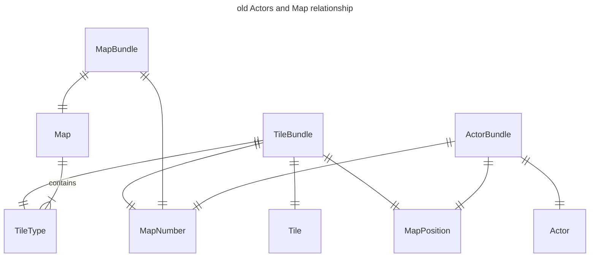
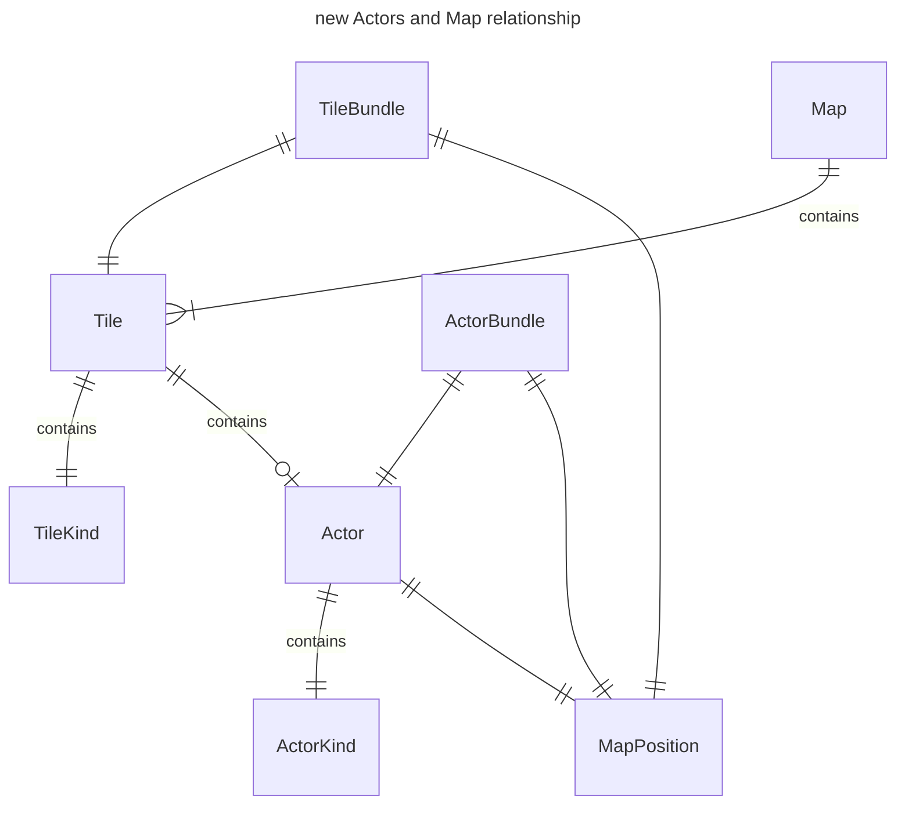

This is already the fifth blog post about this project! It's probably the
longest I've dedicated to a single project. In this entry, I've focused on 
extensive refactoring, tackling code smells, and laying down the groundwork for
what will eventually become the pathfinding system.

Additionally, I managed to enable [Mermaid diagrams](https://mermaid.js.org/)
rendering in my [hugo](https://gohugo.io/) theme. As we say in French, *une
image vaut mille mots* (a picture is worth a thousand words), so I hope the
diagrams will help illustrate the changes I've made to the project.

1. [Bug Fixing: Actors overlapping](#bug-fixing-actors-overlapping-and-on-non-walkable-tiles)
2. [Refactor: Actors positions owned by Map](#refactor-actors-positions-owned-by-map)
3. [Mechanics/System: Actors spawning](#mechanicssystem-actors-spawning)
3. [Mechanics/System: Actors movement](#mechanicssystem-actors-movement)
    1. [Random movements](#random-movements)
    2. [Straight forward movements](#straight-forward-movements)
4. [Miscellaneous](#miscellaneous)
5. [Final result](#final-result)
6. [Closing thoughts](#closing-thoughts)

You can still read the [previous devlog](/posts/devlog-0003) if you missed it.

---

## Bug Fixing: Actors overlapping and on non-walkable tiles

Last month, the map and actors cleanup were introduced when the player leaves
to another map. I didn't notice at the time, but the order of operations is
important as it resulted in a bug where actors are left over the new map and
possibly overlap with other actors or non-walkable tiles.






The solving involved doing this order of operations:

1. Initialize Map
2. Initialize Actors
3. Cleanup Actors
4. Cleanup Map

Instead of:

1. Initialize Map
2. Initialize Actors
3. Cleanup Map
4. Cleanup Actors

I won't go into code details because I've went through big refactors on how the
actors are associated with map tiles (see following section).

---

## Refactor: Actors' positions owned by Map

In an over-engineered ECS fashion, I previously created a component `MapNumber`
to represent how actors and maps are linked together. Why I did it that way was
because I thought it would be easier to implement batch generation for maps (
i.e. generate `n` maps, for map `0` to `n`, generate `x` mobs).



This is a typical case of premature optimization, as batch generation for maps
is not a thing for now. Making this ownership via a component was a bad idea as
it impacted all systems by making the queries chunkier and adding additional
filtering everytime something is done for the current map and actors. For
example:

```rust
/// Checks if the player receives a directional input (i.e. an arrow key or a
/// WSQD key pressed), and moves the `Player` position accordingly.
pub fn check_player_directional_input(
    mut next_state: ResMut<NextState<GameState>>,
    mut query_player: Query<&mut MapPosition, With<Player>>,
    query_actors: Query<
        (&MapPosition, &MapNumber),
        (With<Actor>, Without<Player>),
    >,
    query_map: Query<(&Map, &MapNumber)>,
    input: Res<ButtonInput<KeyCode>>,
    current_map_number: Res<CurrentMapNumber>,
) {
    let mut player_pos = query_player.single_mut();

    let map = {
        let mut map_found = None;
        for (m, m_number) in &query_map {
            if m_number.0 == current_map_number.0 {
                map_found = Some(m);
            }
        }
        match map_found {
            Some(m) => m,
            None => {
                panic!(
                    "no map found to check for the directional player input"
                );
            }
        }
    };

    let occupied_pos: Vec<MapPosition> = query_actors
        .iter()
        .filter(|(_, m_n)| m_n.0 == current_map_number.0)
        .map(|(p, _)| p)
        .cloned()
        .collect();

    if input.any_just_pressed([KeyCode::ArrowRight, KeyCode::KeyD])
        && can_move_right(&player_pos, map, &occupied_pos)
    {
        move_right(&mut player_pos);
        next_state.set(GameState::EnemyTurn);
    }

    if input.any_just_pressed([KeyCode::ArrowLeft, KeyCode::KeyA])
        && can_move_left(&player_pos, map, &occupied_pos)
    {
        move_left(&mut player_pos);
        next_state.set(GameState::EnemyTurn);
    }

    if input.any_just_pressed([KeyCode::ArrowUp, KeyCode::KeyW])
        && can_move_up(&player_pos, map, &occupied_pos)
    {
        move_up(&mut player_pos);
        next_state.set(GameState::EnemyTurn);
    }

    if input.any_just_pressed([KeyCode::ArrowDown, KeyCode::KeyS])
        && can_move_down(&player_pos, map, &occupied_pos)
    {
        move_down(&mut player_pos);
        next_state.set(GameState::EnemyTurn);
    }
}
```

The following code is really different from last month, but now, the tiles are
managed by the Map, and the actor are managed by the tiles:

```rust
/// Represents a tile.
#[derive(Clone, Component, Copy)]
pub struct Tile {
    pub kind: TileKind,
    pub actor: Option<Actor>,
}
```

```rust
/// Represents the environment where the actors interact together. A map is
/// made of tiles which has different properties for the actors.
#[derive(Component)]
pub struct Map {
    /// The map's width.
    pub width: usize,
    /// The map's height.
    pub height: usize,
    /// All tiles for the map, the vector index corresponds to the tile
    /// coordinates.
    pub tiles: Vec<Tile>,
    /// The exits positions for the map.
    pub exits: Vec<MapPosition>,
}
```

Additionally, a component `OnDisplay` is used to differentiate between the map
and actors that are on the screen with the ones that are kept in memory
(although there's no such thing for now):

```rust
/// Represents an entity that is on the screen and displayable by the camera.
#[derive(Component)]
pub struct OnDisplay;
```



It makes the queries simpler:

```rust
pub fn check_player_move_via_keys(
    mut next_state: ResMut<NextState<GameState>>,
    mut q_actors: Query<(&mut MapPosition, &Actor), With<OnDisplay>>,
    mut q_map: Query<&mut Map, With<OnDisplay>>,
    input: Res<ButtonInput<KeyCode>>,
) {
    let mut map = q_map.single_mut();

    let (mut pos_player, _) = q_actors
        .iter_mut()
        .filter(|(_, a)| a.is_player())
        .last()
        .expect("no player pos found");

    let pos_player_old = pos_player.clone();

    if input.any_just_pressed(KEYS_PLAYER_MOVE_RIGHT)
        && can_move_right(&pos_player.clone(), &map)
    {
        move_right(&mut map, &mut pos_player).unwrap();
    }

    if input.any_just_pressed(KEYS_PLAYER_MOVE_LEFT)
        && can_move_left(&pos_player.clone(), &map)
    {
        move_left(&mut map, &mut pos_player).unwrap();
    }

    if input.any_just_pressed(KEYS_PLAYER_MOVE_UP)
        && can_move_up(&pos_player.clone(), &map)
    {
        move_up(&mut map, &mut pos_player).unwrap();
    }

    if input.any_just_pressed(KEYS_PLAYER_MOVE_DOWN)
        && can_move_down(&pos_player.clone(), &map)
    {
        move_down(&mut map, &mut pos_player).unwrap();
    }

    if pos_player_old != pos_player.clone() {
        next_state.set(GameState::EnemyTurn);
    }
}
```

## Mechanics/System: Actors spawning

Previously, the number of actors spawned for a map was the same no matter the
map size. With this new function, I can extend how many actors are spawned,
the kind of actors and so on:

```rust
pub fn generate_spawn_counts(_map: &Map) -> HashMap<ActorKind, usize> {
    let mut result = HashMap::new();
    result.insert(ActorKind::Blob, 3);
    result.insert(ActorKind::Rabbit, 3);
    return result;
}
```

```rust
/// Spawn mob entities (enemies, NPC...) on the current map.
pub fn spawn_mobs_on_current_map(
    mut commands: Commands,
    mut q_map: Query<&mut Map, With<OnDisplay>>,
    mut q_actors: Query<(&mut MapPosition, &Actor), With<OnDisplay>>,
    tileset: Res<TilesetActor>,
    mut next_game_state: ResMut<NextState<GameState>>,
) {
    let mut map = q_map.single_mut();

    let pos_occupied: Vec<MapPosition> =
        q_actors.iter().map(|(m_p, _)| *m_p).collect();

    let spawn_counts = generate_spawn_counts(&map);
    let actor_quantity = spawn_counts.values().fold(0, |acc, &x| acc + x);
    let pos_actors = map
        .generate_random_positions(actor_quantity, &pos_occupied)
        .unwrap();

    let mut spawned_quantity = 0;
    for (actor_kind, quantity) in spawn_counts.iter() {
        spawn_creature(
            *actor_kind,
            &mut map,
            &pos_actors[spawned_quantity..spawned_quantity + quantity],
            &mut commands,
            &tileset,
        )
        .unwrap();
        spawned_quantity += quantity;
    }

    // initialize the player only if there's no player created
    let pos_player = q_actors.iter_mut().filter(|(_, a)| a.is_player()).last();

    // if the player already exists, set a new spawn on the map
    if let Some(mut pos_player) = pos_player {
        let pos_new_spawn = map
            .generate_random_positions(1, &pos_actors)
            .expect("failed to initialize player spawn")
            .pop()
            .unwrap();

        pos_player.0.x = pos_new_spawn.x;
        pos_player.0.y = pos_new_spawn.y;
    } else {
        let pos_player_spawn = map
            .generate_random_positions(1, &pos_actors)
            .unwrap()
            .last()
            .unwrap()
            .clone();

        spawn_creature(
            ActorKind::Player,
            &mut map,
            &[pos_player_spawn],
            &mut commands,
            &tileset,
        )
        .unwrap();
    }
    next_game_state.set(GameState::PlayerTurn);
}
```

```rust
/// Spawn creatures at specific map positions.
pub fn spawn_creature(
    actor_kind: ActorKind,
    map: &mut Map,
    positions: &[MapPosition],
    commands: &mut Commands,
    tileset: &TilesetActor,
) -> Result<(), String> {
    for position in positions {
        let tile_pos = map.as_tile_index(position).unwrap();
        if map.tiles[tile_pos].actor.is_some() {
            return Err("tile already occupied".into());
        }
        let actor = Actor::new(actor_kind);
        map.tiles[tile_pos].actor = Some(actor);
        commands
            .spawn((OnDisplay, ActorBundle::new(actor, *position, tileset)));
    }
    Ok(())
}
```

## Mechanics/System: Actors movement

### Random movements

### Straight forward movements

## Miscellaneous

## Final result

## Closing thoughts

As always, if you have any suggestions/remarks regarding the devlog content, the
code or anything else, please reach out! Don't hesitate to drop a &#11088; on
the [project's page](https://github.com/boreec/roguelike).

The project is growing and it's really exciting, thank you everyone.

